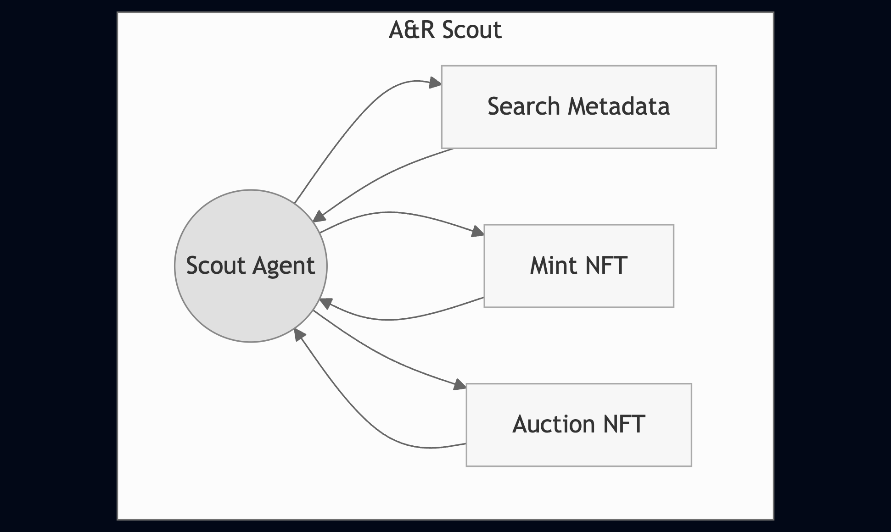
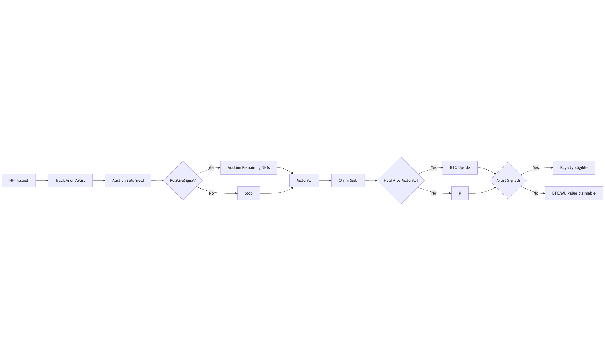

# Musika Labs  
### Building the financial layer of music

---

## The Fragmented System

- Rights scattered across incompatible databases  
- Royalties slow, often unpaid  
- No standard rail for artists  
- Manual admin = systemic failure  

🎤 **Talent isn’t the issue. Infrastructure is.**

---

## Our Vision

> “The only barrier to entry should be creativity itself.”

Musika is building the **compliant, programmable backend** the music industry never had—starting with publishing.

---

## The Early Insight

🎧 What if artists could be paid **by the second**?

But the current system couldn’t support it.  
We hit a wall—then rebuilt the foundation.

---

## Our Approach

### Rebuild. Then elevate.

We laid the groundwork across **two tightly integrated divisions**:

---

## Internal Structure

### 1. Publishing Division

- Legally integrated with **ASCAP** and the **MLC**  
- Collects royalties, administers rights  
- Expanding to include **distributors and venues**

---

### 2. Software & Automation

- Streamlines publishing operations  
- Automates royalty tracking  
- Converts verified metadata into **on-chain assets**  
- Powers the protocol behind our NFTs

---

## First Applications

### Musika Digital Rights Marketplace (MDRM)

- Solana-based NFTs representing real copyrights  
- Embedded metadata: splits, writers, ISRC, performance rights  
- Pulled from **ASCAP**, **MLC**, **Soundcharts**

---

### Musika Social Layer

- Lightweight publishing-aware interface  
- Metadata evolves with collaboration  
- Visual attribution and ownership flows  
- Prepares ecosystem for audience engagement

---

## Protocol Layer

### $MU Token

- Capped. BTC-anchored.  
- Not live—seeded via $4K BTC vault by team  
- Future use:  
  - Royalty liquidity  
  - Creator advances  
  - On-chain licensing  
  - Streaming micropayments

---

### Bounty Hunt Protocol

- Surfaces **unclaimed royalties** from public records  
- Verified metadata → outreach → onboarding  
- Converts recovery into discovery  
- Pipeline into Scout Agent

---

### Scout: Automated A&R Agent

- Autonomous agent trawls SoundCloud for breakout signals
- Discovery stamped with ULID, signed via Ed25519, logged on Solana
- Signature generates a deterministic identicon—the visual fingerprint of the NFT
- When the artist signs, we reveal the signature seeds for public verification
- No trust, no leaks. Fully verifiable.

---

## Scout: Discovery Without Disclosure

---

## 2025 Objectives

- Finalize MVP (submitted here)  
- Expand automation (ASCAP, MLC, distribution)  
- Launch NFT listing for “Texas, Bourbon, and You”  
- Deploy Bounty + Scout protocols  
- Begin ticketing pilot  
- Sign artists under publishing arm  
- Seed $MU via frozen BTC vault  
- Private ICO: 10% initial cap

---

## Future Launches

### Peer-to-Peer Music Device

- Offline-first  
- Pays artists mechanical royalties on first listen  
- Syncs with protocol—tracks attribution & plays  
- Music ownership, even without the internet

---

### ANONBOND NFTs

- Agent mints NFT; shadows an unsigned artist  
- Launch auction sets yield in $MU by market forces
- Strong buzz → release remaining NFTs; weak buzz → NFT supply locks  
- Maturity date: can claim the $MU yield  
- Hold past maturity → share in platform $MU/BTC pool  
- Artist signs with Musika → NFT earns publishing royalties  
- One token, three payoffs: $MU, BTC, royalties

---

## ANONBOND Flow

---

# Musika Is...

- A real publishing company  
- A dev shop  
- A compliance-first protocol  
- A quiet rail beneath rights-based media

🎶 **Music is just the start.**  
This is a new protocol layer for creative IP.

---

# Thank You

### Let’s make music programmable.
